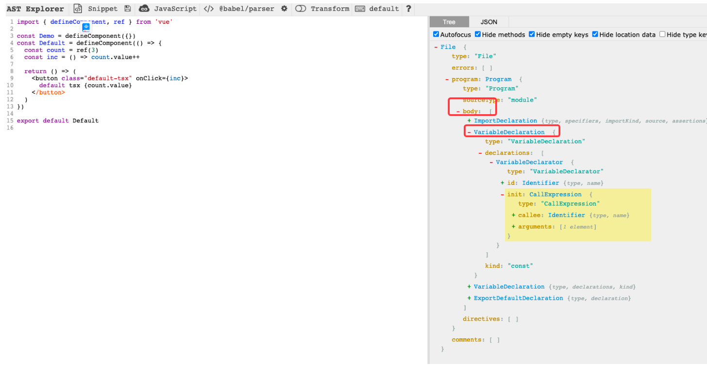

## ast



几种写法ast处理

```ts
// 0: VariableDeclaration
const Comp = defineComponent({})
// 1: ExportNamedDeclaration
export const Comp = defineComponent({})
// 2: ExportNamedDeclaration + specifiers
const Comp = defineComponent({})
export { Comp }
// 3. ExportDefaultDeclaration
export default xxx
```

declaredComponents：声明的组件
hotComponents代表hmr的组件，前提是需要export的组件才需要hot

## 插件对源代码做了什么 & hmr处理

```js
if (hotComponents.length) {
  if (hasDefault && (needHmr || ssr)) {
    // 代码替换
    result.code =
      result.code!.replace(
        /export default defineComponent/g,
        `const __default__ = defineComponent`,
      ) + `\nexport default __default__`
  }

  if (needHmr && !ssr && !/\?vue&type=script/.test(id)) {
    let code = result.code
    let callbackCode = ``
    for (const { local, exported, id } of hotComponents) {
      code +=
        `\n${local}.__hmrId = "${id}"` +
        `\n__VUE_HMR_RUNTIME__.createRecord("${id}", ${local})`
      callbackCode += `\n__VUE_HMR_RUNTIME__.reload("${id}", __${exported})`
    }

    code += `\nimport.meta.hot.accept(({${hotComponents
      .map((c) => `${c.exported}: __${c.exported}`)
      .join(',')}}) => {${callbackCode}\n})`

    result.code = code
  }

  if (ssr) {
    const normalizedId = normalizePath(path.relative(root, id))
    let ssrInjectCode =
      `\nimport { ssrRegisterHelper } from "${ssrRegisterHelperId}"` +
      `\nconst __moduleId = ${JSON.stringify(normalizedId)}`
    for (const { local } of hotComponents) {
      ssrInjectCode += `\nssrRegisterHelper(${local}, __moduleId)`
    }
    result.code += ssrInjectCode
  }
}
```
