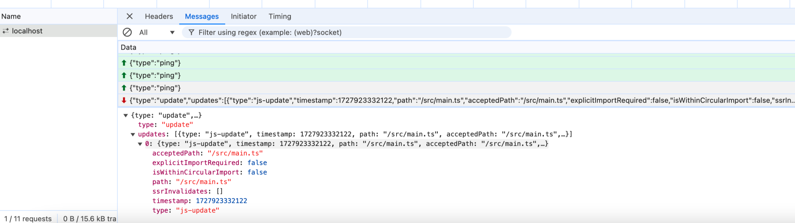
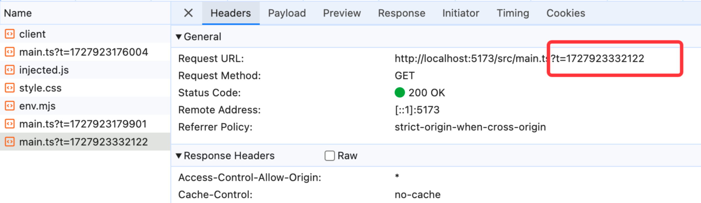

# vite hmr

```ts
interface ImportMeta {
  url: string

  readonly hot?: import('./hot').ViteHotContext

  readonly env: ImportMetaEnv

  glob: import('./importGlob').ImportGlobFunction

  globEager: import('./importGlob').ImportGlobEagerFunction
}
```

热更新：框架相关，vite没有做，而是暴露hmr api

如果没有集成任何框架，会自动刷新，不会热更新

热更新原理：ws监听，文件有变动，会产生一个ws事件，server推送一个事件到浏览器，浏览器知道那个文件更新了然后重新发起一个js请求来替换




glob-import

```ts
const globModules = import.meta.glob('./demo/*') // 可以拿到demo下面所有的文件信息
const globModules = import.meta.glob('./demo/*.json') // 可以拿到demo下面所有的json文件信息
// globEager: 编译的时候就把所有代码引入进来，无需像glob一样需要在运行时import
```

底层库：fast-glob
